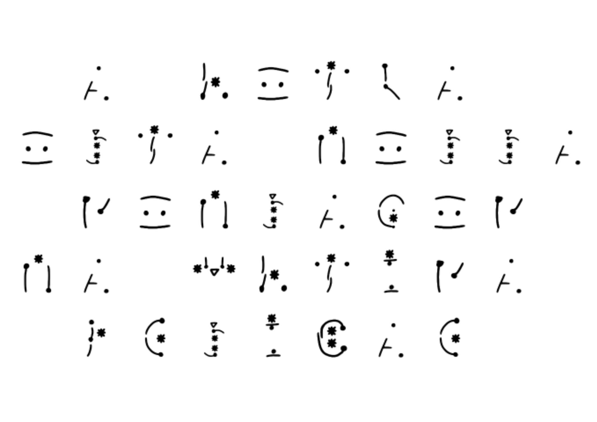
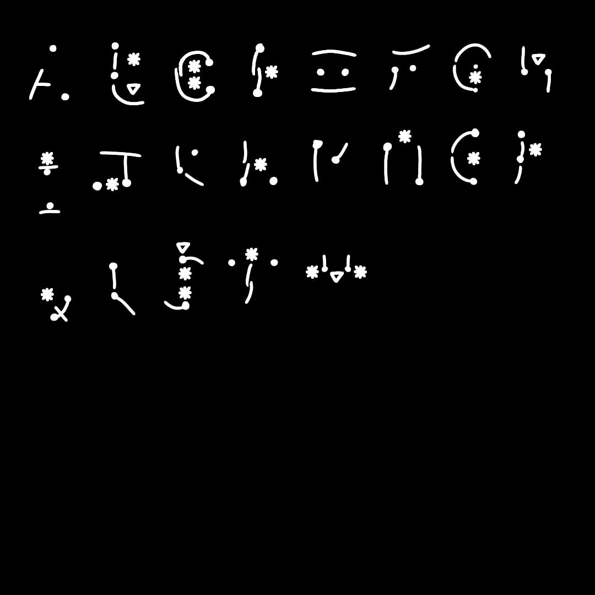

# Desafio de Criptografia

Para este desafio, usaremos a linguagem **2P2T**, desenvolvida por [João Pedro Boiago](https://github.com/jopedroboiago135).

As instruções para decifrar a linguagem estão divididas em **três etapas**:

1. **Primeira folha (não criptografada):** apresenta o contexto da linguagem e as instruções explícitas para os próximos passos.

2. **Segunda folha (criptografada com a cifra de César):** contém as instruções para descobrir o **primeiro modificador** da linguagem.

3. **Terceira folha (código morse):** O símbolo "▽" está vinculado a um dispositivo que toca uma mensagem em morse do segundo modificador.

Por fim, uma mensagem escrita com a fonte **2P2T**, deverá ser usada para revelar a **ordem correta dos dígitos** encontrados.

---

## Regras da linguagem

### Regras básicas

* Todas as letras são construídas a partir de **2 traços** e **2 pontos base**.
* O usuário deve sempre adicionar 2 traços:

  * Um deles **obrigatoriamente conecta os dois pontos**;
  * O outro deve ser posicionado de forma lógica para formar a letra correspondente no alfabeto tradicional.
* Nenhum traço pode passar por cima de um **modificador**.

### Modificadores

* **Estrela (★):** remover uma linha (usar apenas 1 traço).
* **Triângulo invertido (▽):** adicionar uma linha extra (usar 3 traços).

---

#### Folha 1:
"Um dos pilares da computação é a criptografia,  ou seja, esconder informações para que somente algumas pessoas possam entender uma determinada mensagem.

Pensando nisso criamos um método de criptografia chamado 2P2T (2 pontos, 2 traços), que consiste em algumas regras simples e modificadores:
* Todas as letras são construídas a partir de **2 traços** e **2 pontos base**.
* O usuário deve sempre adicionar 2 traços:
  * Um deles **obrigatoriamente conecta os dois pontos**;
  * O outro deve ser posicionado de forma lógica para formar a letra correspondente no alfabeto tradicional.
* Nenhum traço pode passar por cima de um **modificador**.

Os modificadores estão nas próximas folhas, mas elas também estão com diferentes tipos de criptografia, quebre-as para entender o que eles fazem e decifrar uma mensagem em 2P2T."

#### Folha 2:
Entregar os participantes uma [roda de cifragem](CifraDeCesar/model2.pdf)

Se começaremem a demorar muito para resolver:
1. Explicar como uma cifra de César funciona
2. Dizer que todas as palavras em português de uma letra são vogais

**texto original:**
O modificador estrela e: faca um traco a menos

**texto de César:**
H fhwbybvtwhk xlmkxet x: ytvt nf mktvh t fxghl

#### Folha 3:
Morse (deixar a tabela de conversão)

▽ = linha extra

Convertido:

▽ = .-.. .. -. .... .- / . -..- - .-. .-

#### Folha 4:

 

## Alfabeto

---